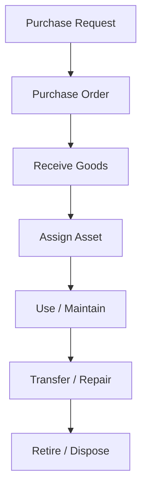
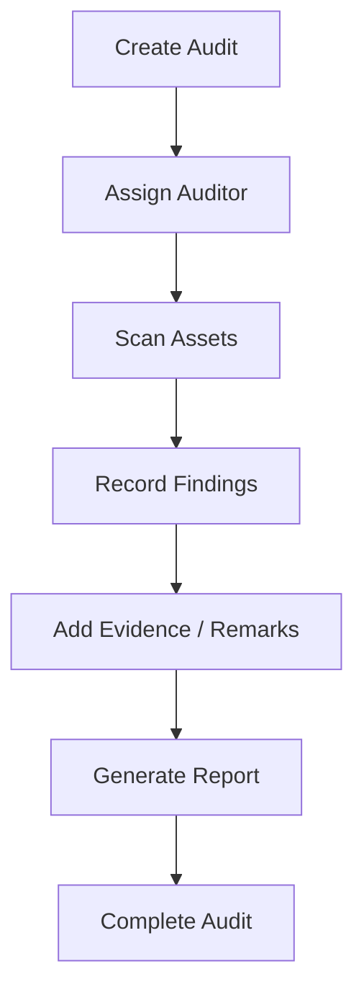

# Inventory Management System - Detailed Requirements Specification

## 1. Executive Summary
The Inventory Management System is a web-based platform designed to manage physical assets, inventory stock, organizational units, and audit activities in a centralized and traceable manner. The system will support educational institutions, churches, and other organizations that need accurate tracking of assets, consumables, and stock movements.

The solution will provide capabilities for asset registration, inventory control, lifecycle tracking, audit operations, barcode and QR scanning, reporting, dashboards, role-based access, and notifications. The audit module is expected to be a core differentiator and will support both scheduled and surprise audits with mobile scanning and digital evidence.

## 2. Business Objectives
The system should help the organization achieve the following objectives:

- Centralize asset and inventory records in one secure platform.
- Improve accountability for fixed assets, consumables, and spare parts.
- Reduce manual errors in stock handling and audit processes.
- Enable faster audit preparation and audit completion.
- Provide real-time visibility into asset status, location, and condition.
- Support department-level and location-level tracking.
- Improve decision-making through dashboards and reports.
- Reduce loss, misuse, and unrecorded asset movement.

## 3. Problem Statement
Many organizations still manage assets and inventory through spreadsheets, paper records, or disconnected tools. This causes:

- Duplicate or incomplete asset records.
- Poor visibility of asset location and ownership.
- Delayed or inaccurate stock movements.
- Difficult and time-consuming audit preparation.
- Limited evidence for missing, damaged, or misplaced assets.
- Lack of standardized workflows for procurement, maintenance, transfer, and disposal.

The proposed system will replace these fragmented processes with a structured, secure, and auditable solution.

## 4. Scope
### In Scope
- Asset registration and tracking.
- Inventory item tracking and stock movement.
- Organizational structure management.
- Purchase request, purchase order, receiving, assignment, transfer, repair, maintenance, retirement, disposal, and donation workflows.
- Audit planning and execution, including mobile scanning.
- Barcode and QR code support for scanning and identification.
- Reporting, dashboards, notifications, search, and security controls.

### Out of Scope
- Financial accounting and general ledger integration.
- Payroll or human resource management.
- ERP-wide enterprise planning modules beyond asset and inventory management.
- Physical hardware procurement and deployment.
- Advanced predictive analytics beyond standard reporting and dashboarding.

## 5. Stakeholders
The following stakeholders are expected to interact with the system:

- Super Administrator: full system access and configuration control.
- Administrator: manages users, settings, and high-level operations.
- Inventory Manager: manages stock, assets, vendors, and inventory processes.
- Auditor: creates and executes audits and records findings.
- Department Head: supervises department assets and approvals.
- Volunteer: may perform basic asset or inventory-related tasks.
- Viewer: read-only access to reports and dashboards.
- Read-only Auditor: can review audit data without editing it.
- IT Team: manages integration, authentication, and system support.
- Finance/Procurement Team: may review purchase requests and orders.
- Vendors: provide items and services related to purchases and maintenance.

## 6. Business Process Overview
The system will support the following end-to-end business processes:

1. Asset and inventory requests are created.
2. Purchase requests and purchase orders are approved and issued.
3. Goods are received and recorded in the system.
4. Items are assigned to departments, rooms, employees, or locations.
5. Assets may be transferred, repaired, maintained, or retired as needed.
6. Audits are planned and executed using mobile or batch scanning.
7. Missing, damaged, or low-stock items are reported and acted upon.
8. Reports and dashboards provide operational status and compliance information.

## 7. Functional Requirements
### 7.1 Asset Management
The system shall allow users to:

- Register new assets with a unique identifier.
- Generate and print barcode and QR codes for each asset.
- Support RFID-ready asset design for future implementation.
- Group assets by category and asset group.
- Support parent/child asset relationships.
- Attach images and multiple supporting documents to an asset.
- Store custom fields for organization-specific asset data.
- Track current location, custodian, status, condition, and warranty details.

### 7.2 Inventory Management
The system shall allow users to:

- Track inventory quantities and stock levels.
- Manage consumables and spare parts separately where needed.
- Record stock in and stock out transactions.
- Manage warehouses, shelves, and bin locations.
- Set reorder levels and generate low-stock alerts.
- Maintain vendor information and purchase history.

### 7.3 Organization Management
The system shall support management of:

- Campus
- Building
- Floor
- Room
- Department
- Cost center
- Employee
- Volunteer
- Ministry (for churches)
- Classroom/Lab (for schools and colleges)

The system shall allow users to associate assets and inventory items with these organizational units.

### 7.4 Asset Lifecycle
The system shall support the full lifecycle of an asset, including:

- Purchase request creation and approval.
- Purchase order creation and tracking.
- Receiving of purchased items.
- Assignment to users, departments, or locations.
- Transfer between locations or custodians.
- Repair and maintenance scheduling.
- Retirement and disposal of obsolete assets.
- Donation of assets to third parties when applicable.

### 7.5 Audit Management
The system shall support comprehensive audit management, including:

- Quarterly, annual, and surprise audits.
- Department-based and room-based audits.
- Creation of audit schedules and audit plans.
- Mobile scanning for physical verification.
- Batch scanning for multiple assets at once.
- Audit progress tracking through a dashboard.
- Reporting of missing and damaged assets.
- Condition tracking and photo evidence capture.
- Auditor remarks and digital signature support.
- Generation of audit completion certificates.

### 7.6 QR/Barcode Scanning
The system shall support:

- USB barcode scanners.
- Bluetooth barcode scanners.
- Android and iPhone camera-based scanning.
- Webcam scanning.
- Continuous scan mode for bulk scanning.
- Duplicate detection to prevent repeated asset scans.

### 7.7 Reporting
The system shall provide reports for:

- Inventory summary
- Asset register
- Department inventory
- Room inventory
- Employee asset list
- Missing assets
- Lost assets
- Damaged assets
- Warranty expiry
- AMC expiry
- Purchase history
- Audit compliance
- Asset movement
- Depreciation
- Label printing

### 7.8 Dashboard
The system shall provide a dashboard displaying:

- Total assets
- Assets by category
- Assets by department
- Assets by building
- Audit completion percentage
- Warranty-expiring items
- Low-stock items
- Recent activity
- Top asset categories
- Audit calendar

### 7.9 User Management & Roles
The system shall support:

- User registration and account management.
- Role-based access control.
- Permission assignment by module and action.
- User-specific access to departments, buildings, rooms, or locations.
- Role definitions for Super Administrator, Administrator, Inventory Manager, Auditor, Department Head, Volunteer, Viewer, and Read-only Auditor.

### 7.10 Notifications
The system shall send notifications for:

- Upcoming audits
- Overdue audits
- Warranty expiry
- Maintenance due
- Low stock
- Approval requests

Notifications may be delivered by email, SMS, and in-app messages.

### 7.11 Search
The system shall support search across:

- Global search
- Barcode search
- QR search
- Serial number
- Employee
- Department
- Vendor
- Purchase order
- Building
- Room

### 7.12 Security
The system shall provide:

- JWT-based authentication.
- Active Directory and LDAP integration support.
- Role-based access control.
- Optional two-factor authentication.
- Complete audit log of user actions.
- Login history tracking.
- Optional IP restrictions.

## 8. Business Rules
The system shall follow the following business rules:

- Each asset must have a unique identifier and a defined status.
- An asset cannot be assigned if it is already assigned to another custodian unless a transfer workflow is completed.
- A stock item below the reorder level should generate a low-stock alert.
- An audit cannot be marked complete until all required audit items are reviewed.
- Assets in repair or maintenance must be marked accordingly and excluded from normal assignment until released.
- A disposal or retirement action must be recorded with reason, date, and approval where required.
- Each stock movement must be traceable to a user, date, and source/destination location.
- Users must only access data permitted by their role and assigned scope.
- Barcode and QR scans should map to a single recognized asset or inventory item.

## 9. Workflow Diagrams
### Asset Lifecycle Workflow

### Audit Workflow

## 10. Use Cases
The system should support the following use cases:

- Register a new asset.
- Generate barcode or QR code for an asset.
- Create a purchase request.
- Approve and issue a purchase order.
- Receive purchased stock.
- Assign an asset to an employee or department.
- Transfer an asset between rooms or departments.
- Record maintenance or repair work.
- Create a new audit and assign auditors.
- Scan assets during an audit.
- Report missing or damaged assets.
- Generate reports and export them to PDF/Excel.
- Receive low-stock or maintenance alerts.

## 11. User Stories
- As an Inventory Manager, I want to register assets quickly so that they can be tracked from purchase to disposal.
- As an Auditor, I want to scan assets during audits so that I can verify physical presence efficiently.
- As a Department Head, I want to view department assets so that I can monitor assigned equipment.
- As a Super Administrator, I want to manage user roles so that data is secure and access is controlled.
- As a Viewer, I want to access dashboards and reports so that I can monitor inventory trends.
- As a Maintenance Team Member, I want to record repair history so that asset condition is transparent.

## 12. Data Model Overview
The system will include core data entities such as:

- Asset
- InventoryItem
- Vendor
- PurchaseRequest
- PurchaseOrder
- StockTransaction
- Warehouse
- Location
- OrganizationUnit
- Employee
- User
- Role
- Audit
- AuditItem
- MaintenanceRecord
- Notification
- Report

Key relationships include:

- An asset belongs to an organization unit and a location.
- A stock transaction affects inventory quantity and location.
- A purchase order may contain multiple inventory items or assets.
- An audit contains multiple audit items and findings.
- A user is assigned one or more roles and may be linked to departments or locations.

## 13. Reporting Requirements
Reports should be available in real time and should support filtering by date, department, location, status, category, and vendor. Reports should support:

- View on screen
- Export to PDF and Excel
- Scheduled report generation where applicable
- Role-based report access
- Summary and detailed report formats

## 14. Non-Functional Requirements
The system should:

- Respond to common operations within a reasonable time.
- Support multiple users concurrently without data loss.
- Be accessible through modern web browsers.
- Provide a responsive interface for desktop and mobile use.
- Maintain data security through encrypted storage and secure authentication.
- Be easy to maintain and extend with new modules.
- Support future integration with external systems such as Active Directory or ERP platforms.

## 15. Audit & Compliance Requirements
The system shall:

- Maintain a complete audit trail for all critical actions.
- Record who created, modified, approved, or deleted records.
- Provide evidence for physical audits through photos, remarks, and signatures.
- Retain records according to organizational policy.
- Prevent unauthorized modification of audit evidence.
- Support compliance reporting for internal and external review.

## 16. Future Enhancements
Possible future enhancements include:

- Integration with ERP and accounting systems.
- Predictive maintenance and lifecycle forecasting.
- AI-based anomaly detection for missing or unusual movements.
- Mobile app enhancements for offline scanning.
- Advanced analytics and business intelligence dashboards.

## 17. Assumptions
The following assumptions apply:

- The organization will provide approved users and roles.
- Barcode and QR labels will be assigned to assets and inventory items.
- Mobile devices will be available for auditors where needed.
- Basic internet connectivity will be available in the deployment environment.
- The organization will define the required approval workflow and naming conventions.

## 18. Risks
Potential risks include:

- Low user adoption due to process change.
- Poor data quality during initial migration.
- Inaccurate or missing barcode labels.
- Resistance from departments to standardized workflows.
- Dependence on mobile device availability for scanning.

## 19. Acceptance Criteria
The system will be considered acceptable when:

- Assets and inventory can be created and tracked successfully.
- Stock in/out transactions are recorded accurately.
- Audit workflows can be completed end to end.
- Users can view dashboards and reports based on assigned roles.
- Notifications are delivered correctly.
- Search and scanning functions return the expected results.
- Security controls restrict unauthorized access.

## 20. Glossary
- Asset: A physical item owned by the organization.
- Inventory Item: A stock item held for use or distribution.
- Barcode: A machine-readable visual code.
- QR Code: A two-dimensional barcode used for quick identification.
- Audit: A formal verification of physical asset or inventory presence and condition.
- Custodian: The person responsible for an asset.
- Reorder Level: The stock threshold that triggers replenishment.
- AMC: Annual Maintenance Contract.
- Disposal: Formal removal of an asset from active use.
